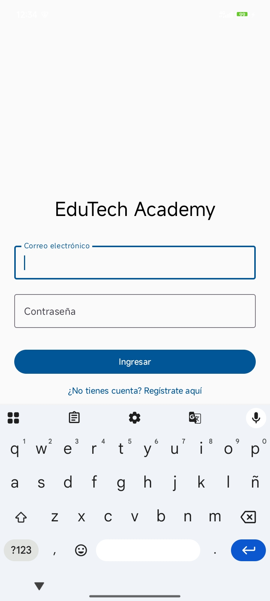
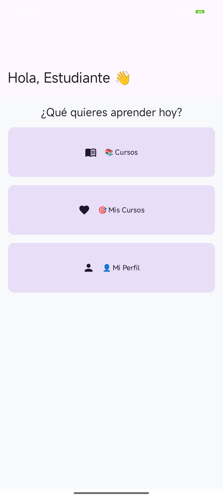
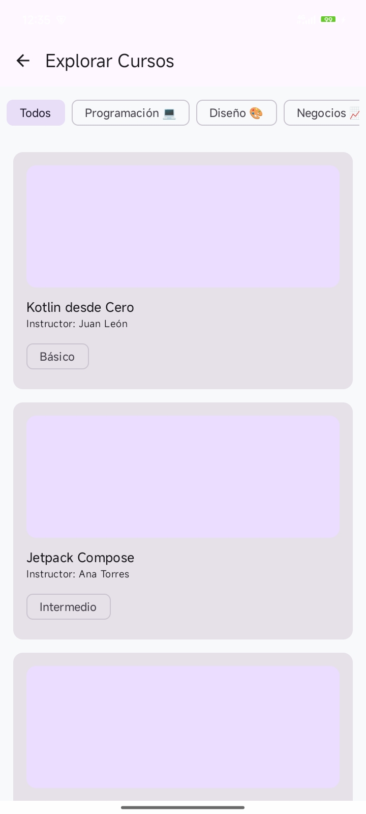

# EduTech Academy 🛠️

**EduTech Academy** es una aplicación móvil educativa de alto rendimiento desarrollada en **Kotlin** utilizando **Jetpack Compose** y **Material 3**. La plataforma ofrece una experiencia de usuario fluida y moderna, permitiendo a los estudiantes explorar cursos, gestionar inscripciones y realizar un seguimiento de su progreso académico en tiempo real.

---

## 📸 Vista Previa del Diseño

### ⏳ 1. Antes de las Mejoras (Diseño Inicial)
*Estas capturas muestran el estado base de la aplicación antes de aplicar los prompts de diseño avanzado.*

| Login                                | Home                               | Catálogo                               |
|--------------------------------------|------------------------------------|----------------------------------------|
|  |  |  |

| Detalle | Mis Cursos | Perfil |
|---------|------------|--------|
|  |  |  |

---

### ✨ 2. Después de las Mejoras (Diseño "Tech-Cool")
*Estas capturas muestran el resultado final tras optimizar la UI/UX con prompts específicos de Gemini.*

- **Paleta de Colores**: Azul Océano, Azul Marino Profundo y Verde Menta.
- **UI/UX**: Bordes redondeados, sombras elevadas y micro-interacciones.

| Login | Home | Catálogo |
|-------|------|----------|
|  |  |  |

| Detalle | Mis Cursos | Perfil |
|---------|------------|--------|
|  |  |  |

---

## ✨ Características Principales

*   **Autenticación Robusta**: Flujo de Login y Registro con validaciones avanzadas (Email, contraseñas coincidentes y seguridad mínima).
*   **Dashboard Interactivo**: Panel principal con accesos rápidos a las funciones clave de la academia.
*   **Catálogo de Cursos**: Listado dinámico con filtros por categorías (Programación, Diseño, Negocios) y etiquetas visuales (`✨ Nuevo`, `🔥 Popular`).
*   **Gestión de Inscripciones**: Formulario detallado de inscripción con validación de DNI y persistencia de datos.
*   **Base de Datos en Tiempo Real**: Sincronización inmediata entre la inscripción y la lista de "Mis Cursos".
*   **Perfil Profesional**: Gestión de información personal (Nombre, Edad, Institución, Bio) con interfaz de edición dedicada.

---

## 🛠️ Stack Tecnológico

*   **Lenguaje**: [Kotlin](https://kotlinlang.org/) (100%)
*   **UI**: [Jetpack Compose](https://developer.android.com/jetpack/compose) con Material 3.
*   **Arquitectura**: MVVM (Model-View-ViewModel) + Repository Pattern.
*   **Base de Datos**: [Room Database](https://developer.android.com/training/data-storage/room) para persistencia local.
*   **Procesamiento**: [KSP (Kotlin Symbol Processing)](https://kotlinlang.org/docs/ksp-overview.html) para una compilación más rápida de Room.
*   **Navegación**: Compose Navigation con animaciones personalizadas (Scale & Fade).
*   **Gestión de Estado**: StateFlow y collectAsStateWithLifecycle para reactividad eficiente.

---

## 🏗️ Estructura del Proyecto

com.tecsup.tarea
├── data
│   ├── local        # Room Database, DAOs y Entities
│   └── repository   # Fuente única de verdad (Data Source)
├── models           # Modelos de datos para la UI
├── navigation       # Definición de rutas y NavHost
├── screens          # Pantallas de la aplicación (UI)
├── ui.theme         # Definición de colores, tipografía y tema
└── viewmodel        # Lógica de negocio y gestión de estado

---

## 🚀 Instalación y Uso

1.  **Clonar el repositorio**:
    ```bash
    git clone https://github.com/tu-usuario/edutech-academy.git
    ```
2.  **Abrir en Android Studio**:
    - Se recomienda **Android Studio Ladybug** o superior.
    - Asegúrate de tener instalado el **JDK 17**.
3.  **Sincronizar Gradle**:
    - El proyecto utiliza **KSP** y **AGP 9.2**, por lo que se sincronizará automáticamente al abrir.
4.  **Ejecutar**:
    - Selecciona un emulador o dispositivo físico con **API 24** (Android 7.0) o superior.

---

## 📝 Configuración Especial
Para corregir incompatibilidades con el soporte de Kotlin incorporado en las últimas versiones de AGP, se ha incluido la siguiente configuración en `gradle.properties`:
```properties
android.disallowKotlinSourceSets=false
```

---

## 👨‍💻 Autor
Desarrollado como parte del proyecto final de Kotlin en **Tecsup**.

---

> "La educación es la herramienta más poderosa para cambiar el mundo, y la tecnología es el vehículo para llevarla a todos." ✨🚀
