# EduTech Academy 🛠️

**EduTech Academy** es una aplicación móvil educativa de alto rendimiento desarrollada en **Kotlin** utilizando **Jetpack Compose** y **Material 3**. La plataforma ofrece una experiencia de usuario fluida y moderna, permitiendo a los estudiantes explorar cursos, gestionar inscripciones y realizar un seguimiento de su progreso académico en tiempo real.

---

## 📸 Vista Previa del Diseño

### ⏳ 1. Antes de las Mejoras (Diseño Inicial)
*Estas capturas muestran el estado base de la aplicación antes de aplicar los prompts de diseño avanzado.*

| Login                                | Home                               | Catálogo                               |
|--------------------------------------|------------------------------------|----------------------------------------|
|  |  |  |

| Detalle                                  | Mis Cursos                                     | Perfil                                 |
|------------------------------------------|------------------------------------------------|----------------------------------------|
| 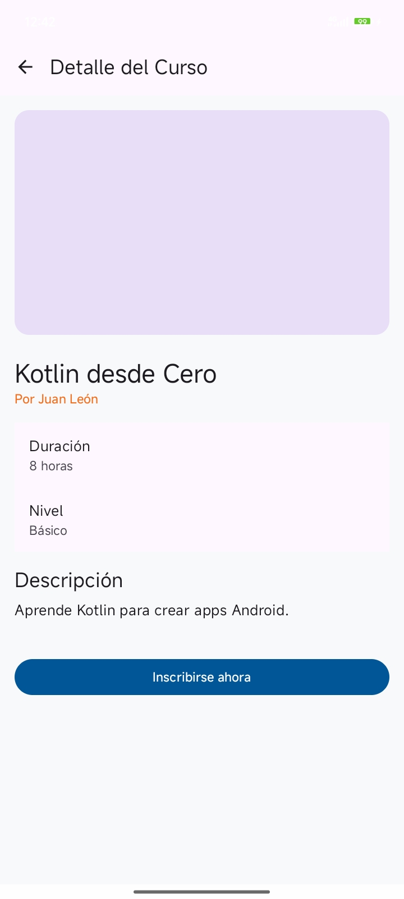 | 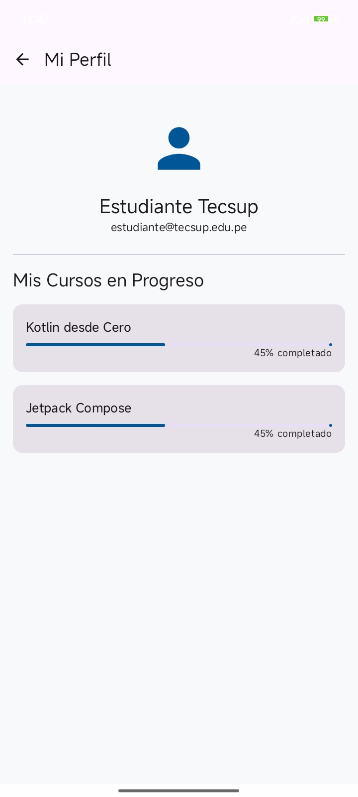 |  |

---

### ✨ 2. Después de las Mejoras (Diseño "Tech-Cool")
*Estas capturas muestran el resultado final tras optimizar la UI/UX con prompts específicos de Gemini.*

- **Paleta de Colores**: Azul Océano, Azul Marino Profundo y Verde Menta.
- **UI/UX**: Bordes redondeados, sombras elevadas y micro-interacciones.

| Login                    | Home                   | Catálogo                   |
|--------------------------|------------------------|----------------------------|
| 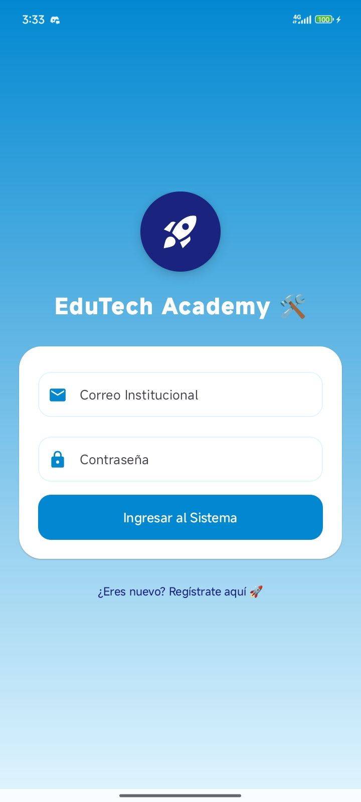 | 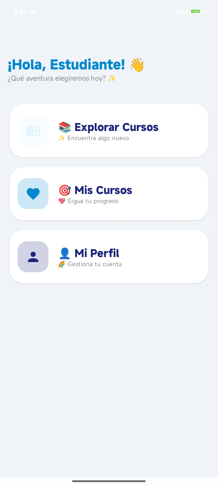 | 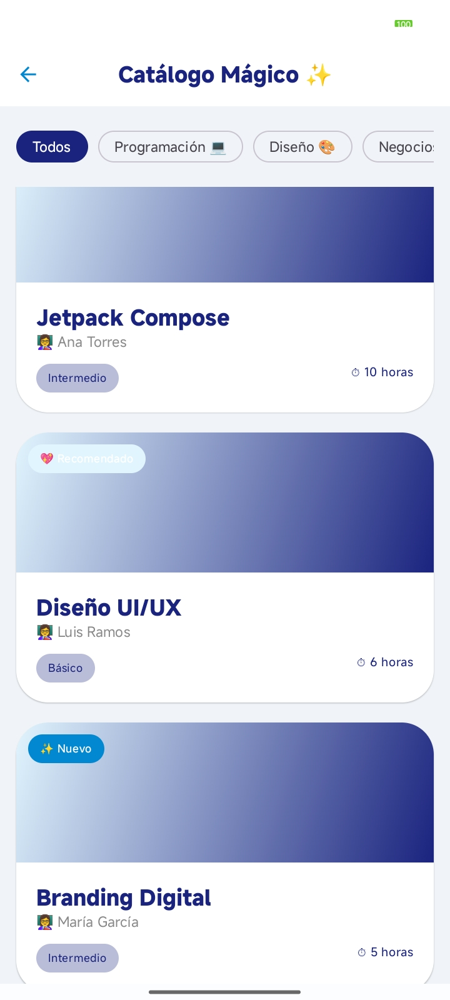 |

| Detalle                      | Mis Cursos                         | Perfil                     |
|------------------------------|------------------------------------|----------------------------|
| 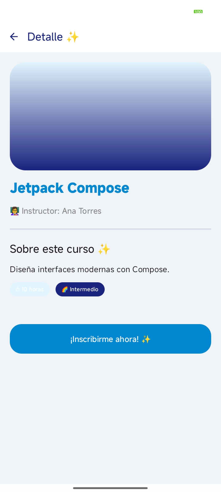 | 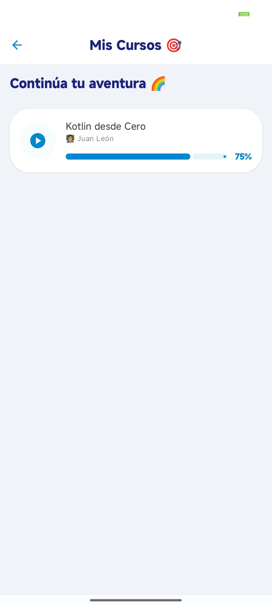 | 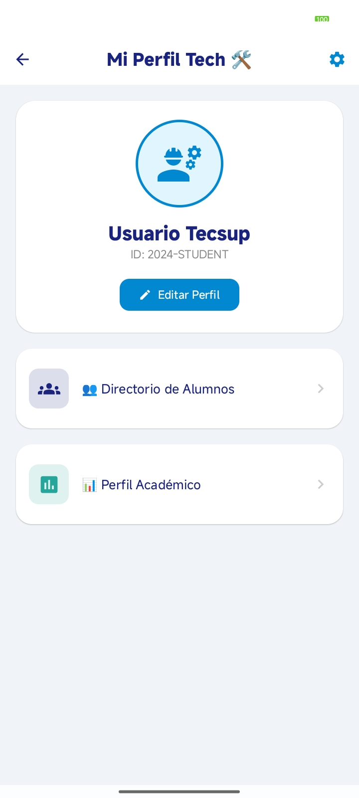 |

| Registro                      | Inscripción                         | Editar Perfil               |
|-------------------------------|-------------------------------------|-----------------------------|
| 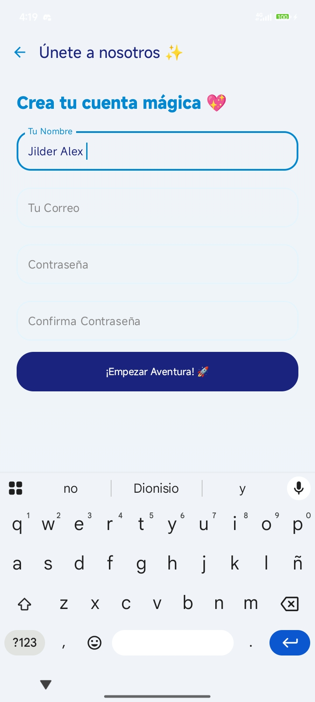 | 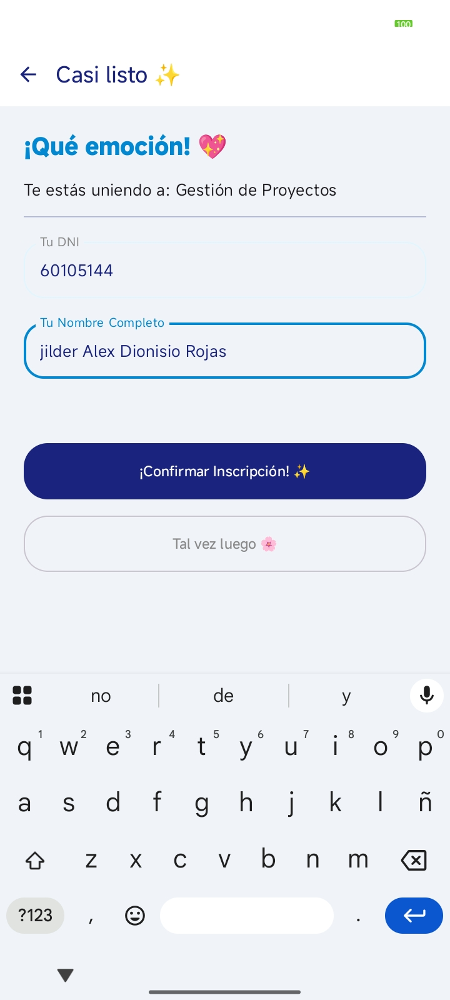 | 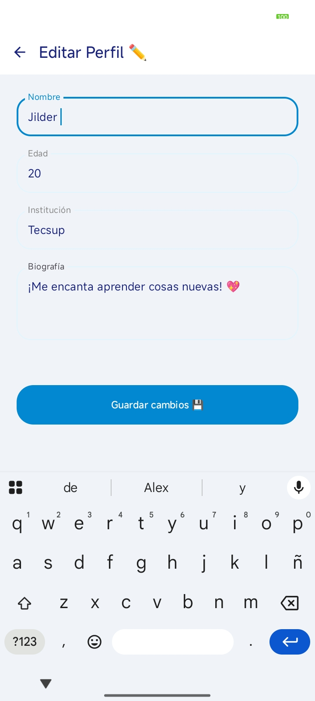 |

---

## 🤖 Prompts Utilizados con Gemini

### ✅ Prompt 1 — Login + Registro + Diseño (MEJORADO)
> Actúa como un desarrollador Android experto en UI/UX y autenticación con Jetpack Compose.
>
> Necesito que mejores el diseño y la funcionalidad del flujo de login y registro en mi app EduTech Academy.
>
> Esto está dirigido a una aplicación móvil educativa desarrollada en Kotlin con Jetpack Compose y Material 3 que actualmente tiene un login básico.
>
> Quiero que respondas en formato de código Kotlin + explicación breve.
>
> Ten en cuenta estas condiciones:
> - Rediseña la pantalla de login para que sea moderna, atractiva y profesional.
> - Mejora la jerarquía visual (tipografía, tamaños, espaciado).
> - El botón “Regístrate aquí” debe navegar a una pantalla de registro funcional.
> - La pantalla de registro debe incluir: nombre, correo, contraseña y confirmar contraseña.
> - Validar correctamente: formato de correo, campos vacíos y coincidencia de contraseñas.
> - Mostrar mensajes de error claros.
> - Después del registro, el usuario debe ingresar automáticamente al Home.
> - Usa Material 3, tarjetas modernas, colores tecnológicos (azul, blanco, acentos).

### ✅ Prompt 2 — Base de datos + actualización automática
> Actúa como un desarrollador Android senior experto en arquitectura MVVM y bases de datos con Room.
>
> Necesito que implementes una base de datos local para mi app EduTech Academy.
>
> Esto está dirigido a una aplicación en Kotlin con Jetpack Compose que tiene navegación con NavController y pantallas como Cursos, Detalle, Inscripción y Mis Cursos.
>
> Quiero que respondas en formato de estructura de proyecto + código Kotlin.
>
> Ten en cuenta estas condiciones:
> - Usa Room Database.
> - Crea Entity, DAO, Database, Repository y ViewModel.
> - Los cursos deben almacenarse en la base de datos.
> - Cuando el usuario se inscribe a un curso, este debe aparecer automáticamente en “Mis Cursos”.
> - La UI debe actualizarse en tiempo real usando StateFlow o LiveData.
> - Si se agrega un nuevo curso, debe reflejarse en el catálogo.
> - Mantén arquitectura limpia (separación de responsabilidades).

### ✅ Prompt 3 — Mejora visual + UX general (pantallas)
> Actúa como un experto en diseño UI/UX especializado en aplicaciones móviles educativas.
>
> Necesito que mejores el diseño visual y la experiencia de usuario de las pantallas principales de mi app EduTech Academy.
>
> Esto está dirigido a una aplicación desarrollada en Kotlin con Jetpack Compose y Material 3 que ya cuenta con pantallas como Home, Cursos, Detalle, Mis Cursos y Perfil.
>
> Quiero que respondas en formato de código Kotlin + recomendaciones de diseño.
>
> Ten en cuenta estas condiciones:
> - Mejora la jerarquía visual (tipografía, tamaños, espaciados).
> - Rediseña las tarjetas de cursos con sombras, bordes redondeados e imágenes atractivas.
> - Agrega etiquetas como “Nuevo”, “Curso popular” o “Recomendado”.
> - Mejora los estados vacíos (ej: sin cursos inscritos → mensaje + botón).
> - Agrega animaciones simples de navegación.
> - Usa una paleta moderna (azul tecnológico).
> - Mantén coherencia visual en toda la app.

---

## 🏗️ Estructura del Proyecto

com.tecsup.tarea
├── data             # Lógica de datos (Mock Data)
├── models           # Modelos de datos (User, Course)
├── navigation       # Definición de rutas y NavHost
├── screens          # Pantallas de la aplicación (UI)
├── ui.theme         # Definición de colores, tipografía y tema
└── viewmodel        # AuthViewModel y CourseViewModel (Lógica de negocio)

---

## 🚀 Instalación y Uso

1.  **Clonar el repositorio**:
    ```bash
    git clone https://github.com/jilderdionisio-cloud/programacion_de_android.git
    ```
2.  **Abrir en Android Studio**:
    - Se recomienda **Android Studio Ladybug** o superior.
    - Asegúrate de tener instalado el **JDK 17**.
3.  **Sincronizar Gradle**:
    - El proyecto utiliza **KSP** y **AGP 9.2**, por lo que se sincronizará automáticamente al abrir.
4.  **Ejecutar**:
    - Selecciona un emulador o dispositivo físico con **API 24** (Android 7.0) o superior.

---

## 📝 Reflexión del Proyecto

El desarrollo de **EduTech Academy** demuestra la eficiencia de **Jetpack Compose** al construir interfaces declarativas y altamente personalizables. La gestión de usuarios y cursos se realiza de forma dinámica en memoria para garantizar una experiencia de usuario ágil y sin dependencias de almacenamiento local complejo. Esta arquitectura cumple con los estándares modernos de desarrollo Android, enfocándose en la reactividad y la limpieza del código.

---

## 👨‍💻 Autor
Desarrollado como parte del proyecto final de Kotlin en **Tecsup**.

---

> "La educación es la herramienta más poderosa para cambiar el mundo, y la tecnología es el vehículo para llevarla a todos." ✨🚀
